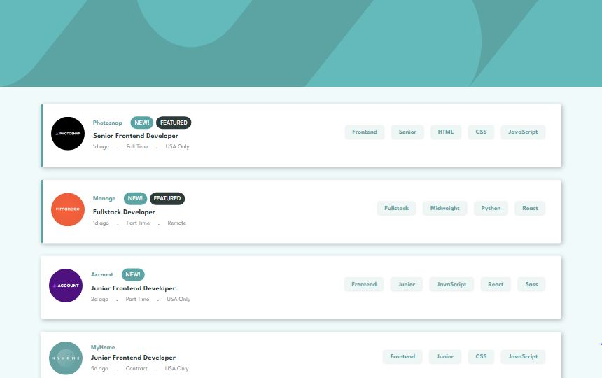
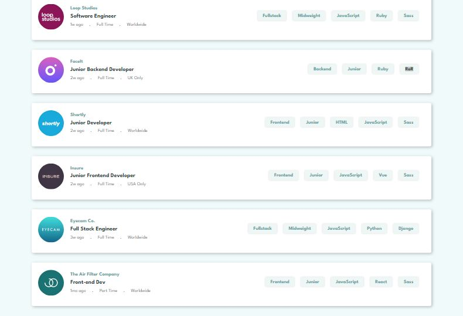
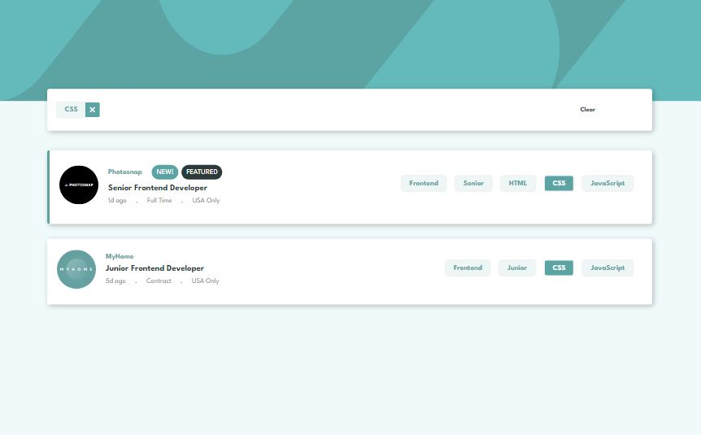

# Frontend Mentor - Job listings with filtering solution

This is a solution to the [Job listings with filtering challenge on Frontend Mentor](https://www.frontendmentor.io/challenges/job-listings-with-filtering-ivstIPCt). Frontend Mentor challenges help you improve your coding skills by building realistic projects. 


## Table of contents

- [Overview](#overview)
  - [The challenge](#the-challenge)
  - [Screenshot](#screenshot)
  - [Links](#links)
- [My process](#my-process)
  - [Built with](#built-with)
  - [What I learned](#what-i-learned)
- [Author](#author)


## Overview

### The challenge

Users should be able to:

- View the optimal layout for the site depending on their device's screen size
- See hover states for all interactive elements on the page
- Filter job listings based on the categories

### Screenshot




- Active State



### Links

- Solution URL: [See my solution to this challenge](https://www.frontendmentor.io/solutions/static-job-listings-with-filtering-W2ib6tPmTk)
- Live Site URL: [View live site here](https://damola-147.github.io/Static-Job-Listing/)

## My process

### Built with

- Semantic HTML5 markup
- CSS custom properties
- Flexbox
- Mobile-first workflow
- JavaScript Fetch and Asynchronus code
- JavaScript Array Methods
- JSON file

### What I learned

This challenge took me a great deal of time; way longer than I had anticipated. The most challenging and time-consuming part was the "filtering" aspect. Having multiple filters to apply made this a difficult task. I abandoned this project multiple times to take on other challenges (completed two during that period), and finally, my "aha" moment came when I was on the verge of capitulating. Lol. 

I built this using HTML, CSS and Vanilla JavaScript.

The Array method `every()` was the key part to solving this problem.

By pushing the inner-texts of each job-list's buttons into an array, the array of texts for each list Item could be compared with an array of "Filtering texts" to see if each of the list-item's texts match with the filters.

```js
function filterListItems() {
  const lists = document.querySelectorAll('li');

  for(let i = 0; i < lists.length; i++) {
    lists[i].classList.add('hide');
  }

  const set = new Set(filterArray);
  const arr = [...set];

  for(let j = 0; j < lists.length; j++) {
    const roles = lists[j].querySelectorAll('[data-role]');
    const levels = lists[j].querySelectorAll('[data-lev]');
    const langs = lists[j].querySelectorAll('[data-lang]');
    const tools = lists[j].querySelectorAll('[data-tool]');

    const listItems = pushItemsToArray([roles, levels, langs, tools]); 

    const boolean = arr.every(item => {
      return listItems.includes(item);
    });

    if(boolean) {
      lists[j].classList.remove('hide');
    }
  }
}
```

## Author

- Website - [Damola-147](https://github.com/Damola-147)
- Frontend Mentor - [@Damola-147](https://www.frontendmentor.io/profile/Damola-147/)
- Twitter - [@adebiyi_stoke](https://www.twitter.com/adebiyi_stoke/)
